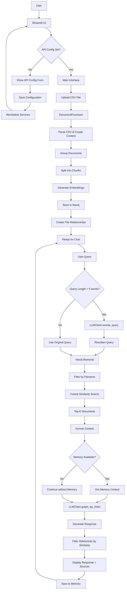

# RAGVeda

A Retrieval-Augmented Generation (RAG) system that leverages Neo4j graph database and LLMs to create an intelligent document processing and question-answering platform. The system processes documents, creates vector embeddings, and enables natural language querying with context-aware responses.

## 🌟 Features

### Core Capabilities
- **Document Processing**: Process and chunk documents with configurable settings
- **Vector Search**: Semantic search with sentence-transformers embeddings
- **LLM Integration**: Powered by Groq LLM for high-performance inference
- **Query Rewriting**: Automatically refines vague queries for better retrieval
- **Context-Aware Responses**: Maintains conversation context for follow-up questions

## 📁 Module Structure

```
modules/
├── config.py              # Configuration management
├── neo4j_manager.py       # Neo4j operations
├── document_processor.py  # CSV processing
├── retrieval.py          # Document retrieval
├── llm_chain.py          # LLM & QA chain
└── ui_components.py      # UI components

main.py                   # Application orchestrator
```

## 🛠 Technical Stack

- **Frontend**: Streamlit
- **Vector Database**: Neo4j with vector search
- **Embeddings**: `sentence-transformers/all-MiniLM-L6-v2`
- **LLM**: Groq with `gemma2-9b-it`

 

## Main Application Flow


 
### Installation

1. Clone the repository:
   ```bash
   git clone https://github.com/yourusername/RAGveda.git
   cd RAGveda
   ```

2. Create and activate a virtual environment:
   ```bash
   python -m venv venv
   # On Windows:
   .\venv\Scripts\activate
   # On macOS/Linux:
   source venv/bin/activate
   ```

3. Install dependencies:
   ```bash
   pip install -r requirements.txt
   ```
 

### Running the Application

1. Start the Streamlit app:
   ```bash
   streamlit run main.py
   ```

2. In the sidebar, provide your API/DB credentials under "API Configuration" and click "Save Configuration".
   - As in Given in .env.example

 
## 🔧 Configuration

Customize the application by modifying `modules/config.py`:
- Adjust chunking parameters (size, overlap)
- Configure embedding model settings
- Set default number of retrieved documents
- Tune similarity thresholds

Additional notes:
- `MEMORY_ENABLED` is on by default in `modules/config.py`. Conversation turns are summarized after several exchanges and reset when you switch files.
- `DEFAULT_TOP_K` controls how many results to retrieve. You can also adjust it at runtime via the slider in the UI.
 
## 🤖 How It Works

1. **Document Processing**:
   - Documents are split into chunks with configurable sizes
   - Each chunk is embedded using sentence-transformers
   - Chunks are stored in Neo4j with metadata and relationships

2. **Query Processing**:
   - Complex queries (longer than a few words) may be automatically rewritten for better retrieval
   - Queries are embedded and used for semantic search
   - Top-k most relevant chunks are retrieved

3. **Response Generation**:
   - Retrieved context is formatted into a prompt
   - LLM generates a response using the provided context
   - Response includes relevant document references
 
## 📝 License

This project is licensed under the MIT License - see the [LICENSE](LICENSE) file for details.

## 🙏 Acknowledgments

- [LangChain](https://python.langchain.com/) for the LLM orchestration framework
- [Neo4j](https://neo4j.com/) for the graph database
- [Groq](https://groq.com/) for high-performance LLM inference
- [Hugging Face](https://huggingface.co/) for the sentence-transformers
